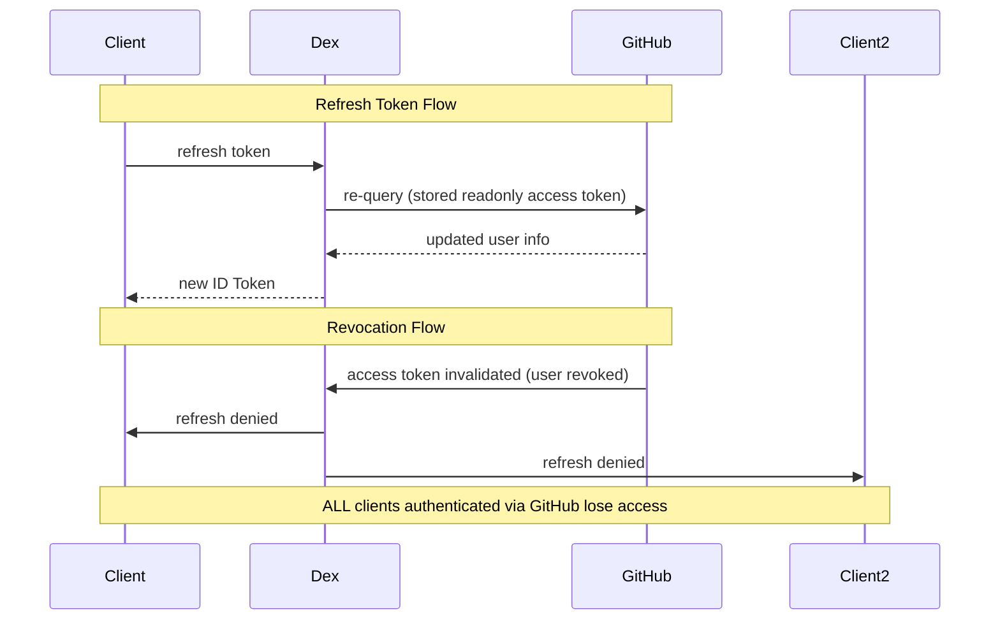

* goal
  * identify the end user -- through -- their GitHub account

* GitHub OAuth2 flow
  * if a client redeems a refresh token -- through -- dex -> dex will re-query GitHub /
    * dex stores a readonly GitHub access token | its backing datastore
  * if you reject dex's access | GitHub -> revoke ALL dex clients / authenticated them -- through -- GitHub



## how to configure?

* | [Github](https://github.com/settings/applications/new)
  * == Settings > Developer Settings > OAuth Apps > New OAuth App
  * register a NEW application /
    * callback URL == `(dex issuer)/callback`
      * _Example:_ if dex is listening | NON-root path https://auth.example.com/dex -> the callback == https://auth.example.com/dex/callback

## GitHub Enterprise

### how to generate TLS assets?

TODO:
Running Dex with HTTPS enabled requires a valid SSL certificate, and the API server needs to trust the certificate of the signing CA using the `--oidc-ca-file` flag.

For our example use case, the TLS assets can be created using the following command:

```bash
$ ./examples/k8s/gencert.sh
```

This will generate several files under the `ssl` directory, the important ones being `cert.pem` ,`key.pem` and `ca.pem`
* The generated SSL certificate is for 'dex.example.com', although you could change this by editing `gencert.sh` if required.

### how to run example client app -- with -- GitHub config?

* steps
  * `./bin/example-app --issuer-root-ca examples/k8s/ssl/ca.pem`
  * | browser,
    * http://127.0.0.1:5555
    * click Login
    * select
      * Log in -- via -- GitHub
      * grant access -- to -- dex to view your profile
