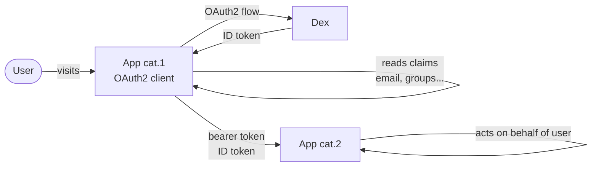
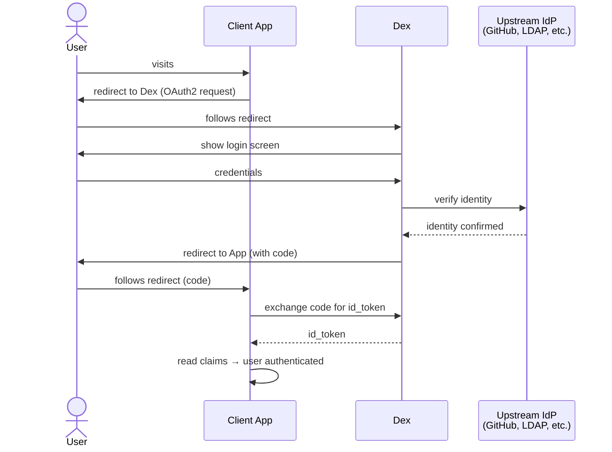
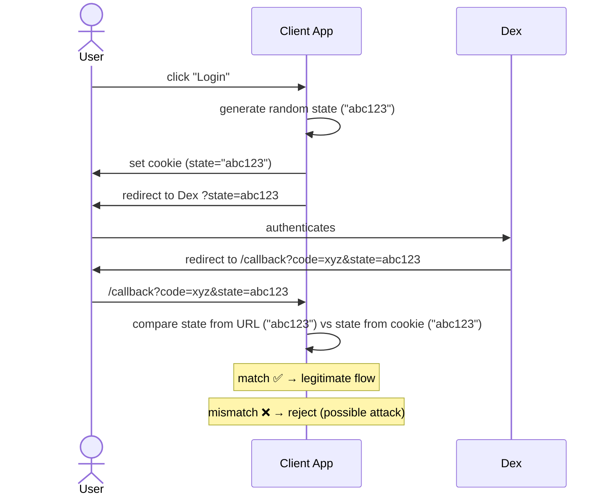

* requirements
  * dex up & running

* goal
  * write applications / drive authentication -- via -- Dex

* apps categories
  1. [apps / request OpenID Connect ID tokens](#apps--request-an-id-token----from----dex)
    * ⚠️requirements⚠️
      * web based
    * uses
      * authenticate an end user
    * == standard OAuth2 clients
  2. [apps / consume ID tokens -- from -- OTHER apps](#apps--consume-id-tokens----from----other-apps)
    * uses
      * verify that a client is acting -- on -- behalf of a user
    * 's credentials == ID tokens
    * _Example:_ [Kubernetes API server](https://kubernetes.io/docs/reference/access-authn-authz/authentication/#openid-connect-tokens)



# apps categories
## apps / request -- , from Dex, -- an ID token



* [Dex example app](https://github.com/dexidp/dex/tree/master/examples/example-app)
  * built-in | dex repo
  * == client app /
    * performs this flow
  * Go packages / are used
    * [go-oidc](https://godoc.org/github.com/coreos/go-oidc)
    * [go-oauth2](https://godoc.org/golang.org/x/oauth2)

* goal
  * how to implement logic | your OWN client app

### how to configure your client app?

* | Dex configuration,
  * specify `staticClients`
* add code

### State tokens

* state parameter
  * arbitrary `string` / Dex will always return -- with the -- callback
  * allows
    * preventing certain kinds of OAuth2 attacks
  * uses
    * by clients to ensure
      * user / started the flow == user / finished it
        * link the user's session -- with the -- state token
        * steps
          * set state == HTTP cookie
          * | user return to the app, compare it



* [OAuth 2.0 Threat Model and Security Considerations](https://tools.ietf.org/html/rfc6819)

## apps / consume ID tokens -- from -- OTHER apps

TODO: 
letting other trusted clients handle the web flows for login
* Clients pass along the ID tokens they receive from dex, usually as a bearer token,
letting them act as the user to the backend service.


To accept ID tokens as user credentials, an app would construct an OpenID Connect verifier similarly to the above example
* The verifier validates the ID token's signature, ensures it hasn't expired, etc
* An important part of this code is that the verifier only trusts the example app's client
* This ensures the example app is the one who's using the ID token, and not another, untrusted client.

```go
// Initialize a provider by specifying dex's issuer URL.
provider, err := oidc.NewProvider(ctx, "https://dex-issuer-url.com")
if err != nil {
    // handle error
}
// Create an ID token parser, but only trust ID tokens issued to "example-app"
idTokenVerifier := provider.Verifier(&oidc.Config{ClientID: "example-app"})
```

The verifier can then be used to pull user info out of tokens:

```go
type user struct {
    email  string
    groups []string
}

// authorize verifies a bearer token and pulls user information form the claims.
func authorize(ctx context.Context, bearerToken string) (*user, error) {
    idToken, err := idTokenVerifier.Verify(ctx, bearerToken)
    if err != nil {
        return nil, fmt.Errorf("could not verify bearer token: %v", err)
    }
    // Extract custom claims.
    var claims struct {
        Email    string   `json:"email"`
        Verified bool     `json:"email_verified"`
        Groups   []string `json:"groups"`
    }
    if err := idToken.Claims(&claims); err != nil {
        return nil, fmt.Errorf("failed to parse claims: %v", err)
    }
    if !claims.Verified {
        return nil, fmt.Errorf("email (%q) in returned claims was not verified", claims.Email)
    }
    return &user{claims.Email, claims.Groups}, nil
}
```

[dex-flow]: img/dex-flow.png
